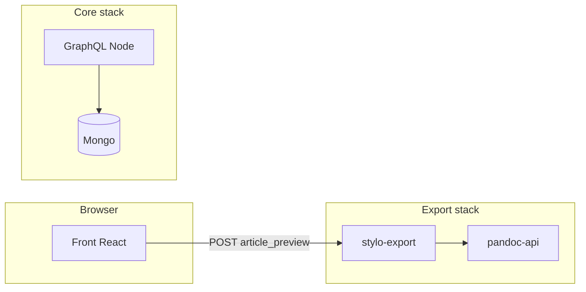

# Simpler preview vs upstream export API

Design note saved for later follow-up (after other cleanup). Covers why Stylo uses a separate export service and lighter-weight preview options.

## Implementation checklist (when you pick an approach)

- [x] Choose preview strategy: **client lite (A)** implemented, with **hosted export (C)** retained as opt-in for fidelity
- [x] Config flag (`SNOWPACK_PUBLIC_PREVIEW_ENGINE=auto|lite|export`) wired through `vite.config.js` → `applicationConfig.previewEngine`; `CollaborativeTextEditor` now dispatches between `useStyloExportPreview` and the new `useLitePreview`
- [x] **A** pipeline in place: `markdown-it` + `markdown-it-footnote` + `DOMPurify` in `front/src/helpers/litePreview.js`; wraps into the same `previewMetadata` shell and existing `preview-imaginations.css`
- [x] Fidelity limits documented in `HOWTO.md` (“Lite (client-only) preview”) and surfaced in the editor as a banner + engine toggle (`article.editor.previewLiteNotice*` / `previewEngine*` i18n keys)

---

## Why upstream uses a separate export API (not “inside the main app”)

The Stylo stack treats **preview and export as the same class of problem**: turn **Markdown + YAML + BibTeX** into **HTML (or PDF, DOCX, …)** using **Pandoc’s pipeline** (templates, filters, citeproc, journal-specific export paths).

- **Pandoc is a native toolchain**, not a small npm dependency. Shipping it “inside” the Node GraphQL app means a **much larger image**, native libs, and ongoing upgrades tied to every app deploy.
- **Resource isolation**: conversion can be **CPU-heavy and slow**; running it out-of-process avoids blocking the API server or the collaborative editing path.
- **Security and robustness**: user-supplied Markdown is executed through a **known, versioned** conversion stack; failures/timeouts are easier to bound at a dedicated service.
- **Scaling and reuse**: one export service can serve **many** Stylo instances and **all** formats (preview HTML, PDF, etc.) with **one** Pandoc version story.
- **Separation of concerns**: the **front** stays static-friendly; it POSTs content to an endpoint that returns HTML (`front/src/hooks/stylo-export.js` → `POST …/api/article_preview`). The **GraphQL** service does not need to embed Pandoc to satisfy the browser.

So “through the API” is really: **keep Pandoc out of the hot path of the main app**, and share one conversion engine for preview + exports.

---

## Simpler ways to get “preview with your CSS” (without upstream Docker images)

These replace **full Pandoc parity** with something lighter. The UI already layers CSS on top of returned HTML (`front/src/components/organisms/textEditor/CollaborativeTextEditor.jsx` — “imaginations” vs “standard”, plus `front/src/helpers/previewMetadata.js` for the header). A lite path would still feed **a string of HTML** into the same shell so **your CSS can stay as-is**.

### Option A — Client-only “lite preview” (simplest operationally)

- **How**: In the browser, parse Markdown with something like **markdown-it** / **micromark** (+ GFM if needed), optionally strip or ignore YAML front matter, **sanitize** output (e.g. DOMPurify), then wrap in the same preview container and apply your existing raw CSS (e.g. `front/src/styles/preview-imaginations.css`).
- **Pros**: No extra containers; instant feedback; full control over typography.
- **Cons**: **No real citeproc / Pandoc citations**, no Pandoc filters, YAML-driven layout differs from export, footnotes and edge cases diverge from “Exporter” output.

**Best when**: you want a **readable draft preview** and accept that it is **not** WYSIWYG with production export.

### Option B — “Lite preview” in GraphQL (one container, still simpler than two-image export stack)

- **How**: Add a small route or resolver that runs **either** a lightweight Markdown-to-HTML library in Node **or** shells out to **`pandoc` CLI** if you install it only in the GraphQL image (single service, no `stylo-export` + `pandoc-api` pair).
- **Pros**: Can reuse server-side sanitization; optional **one** Pandoc binary without the separate HTTP export microservice.
- **Cons**: Pandoc-in-GraphQL still **enlarges the GraphQL image** and couples preview load to the API; citeproc/BibTeX wiring is **your** responsibility (today the export service encapsulates that contract).

**Best when**: you want closer fidelity than pure JS but refuse a second deployment unit; you accept heavier `graphql` images.

### Option C — Optional hosted export (zero local Docker)

- Point `SNOWPACK_PUBLIC_PANDOC_EXPORT_ENDPOINT` at a **hosted** Stylo export URL (as in infra inventories / Netlify examples) so local compose stays **mongo + minio + graphql + front** only.
- **Pros**: No local Pandoc stack.
- **Cons**: Network dependency, latency, privacy, and policy constraints.

---

## If you implement Option A or B in-repo later (concise touchpoints)

- **Hook**: extend or parallel `front/src/hooks/stylo-export.js` (e.g. mode from env: `VITE_PREVIEW_ENGINE=lite|export`) so SWR either skips the export POST or calls a new internal `/api/...` route.
- **UI**: keep `CollaborativeTextEditor.jsx` preview branches; only the **source of `__html`** changes.
- **CSS**: unchanged if the lite renderer outputs compatible class structure, or add a thin wrapper class and adjust selectors.

---

## Recommendation

- For **minimum moving parts** while keeping **your CSS**: **Option A (client-only lite preview)** + clear UI copy that it is an **approximation**, not export-identical.
- Keep **export-based preview** for users who run the full stack or a **hosted export URL** (Option C) when fidelity matters.
