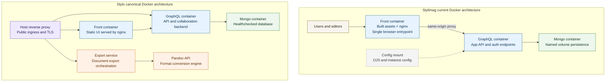

# Stylimag and Stylo Docker Architectures

This version is formatted for documentation or presentation use.

```mermaid
flowchart TB
    classDef client fill:#f8f5ef,stroke:#7a5c1b,color:#2b2110,stroke-width:1px;
    classDef ingress fill:#efe9ff,stroke:#5b4bb7,color:#221d4f,stroke-width:1px;
    classDef app fill:#e7f3ff,stroke:#1d5f91,color:#11344d,stroke-width:1px;
    classDef data fill:#edf7ed,stroke:#2e7d32,color:#15361a,stroke-width:1px;
    classDef export fill:#fff1e6,stroke:#c96a1b,color:#5a2d08,stroke-width:1px;
    classDef note fill:#f4f4f4,stroke:#888,color:#333,stroke-dasharray: 4 3;

    user[Users and editors]:::client

    subgraph stylimag[Stylimag current Docker architecture]
        frontA[Front container\nBuilt assets + nginx\nSingle browser entrypoint]:::app
        gqlA[GraphQL container\nApp API and auth endpoints]:::app
        dbA[Mongo container\nNamed volume persistence]:::data
        cfgA[Config mount\nOJS and instance config]:::note
        user --> frontA
        frontA -->|same-origin proxy| gqlA
        gqlA --> dbA
        cfgA -.-> gqlA
    end

    subgraph stylo[Stylo canonical Docker architecture]
        edgeB[Host reverse proxy\nPublic ingress and TLS]:::ingress
        frontB[Front container\nStatic UI served by nginx]:::app
        gqlB[GraphQL container\nAPI and collaboration backend]:::app
        dbB[Mongo container\nHealthchecked database]:::data
        exportB[Export service\nDocument export orchestration]:::export
        pandocB[Pandoc API\nFormat conversion engine]:::export
        edgeB --> frontB
        edgeB --> gqlB
        edgeB --> exportB
        frontB --> gqlB
        gqlB --> dbB
        exportB --> pandocB
    end
```