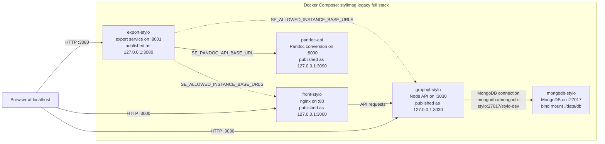

# Stylimag Legacy Full-Stack Architecture

This diagram captures the legacy Stylimag Docker stack preserved in `docker-compose.old.yaml`.

```mermaid
flowchart LR
    browser[Browser at localhost]

    subgraph compose[Docker Compose: stylimag legacy full stack]
        front[front-stylo\nnginx on :80\npublished as 127.0.0.1:3000]
        graphql[graphql-stylo\nNode API on :3030\npublished as 127.0.0.1:3030]
        mongo[mongodb-stylo\nMongoDB on :27017\nbind mount ./data/db]
        export[export-stylo\nexport service on :8001\npublished as 127.0.0.1:3080]
        pandoc[pandoc-api\nPandoc conversion on :8000\npublished as 127.0.0.1:3090]
    end

    browser -->|HTTP :3000| front
    browser -->|HTTP :3030| graphql
    browser -->|HTTP :3080| export
    front -->|API requests| graphql
    graphql -->|MongoDB connection\nmongodb://mongodb-stylo:27017/stylo-dev| mongo
    export -->|SE_PANDOC_API_BASE_URL| pandoc
    export -.SE_ALLOWED_INSTANCE_BASE_URLS.-> front
    export -.SE_ALLOWED_INSTANCE_BASE_URLS.-> graphql
```