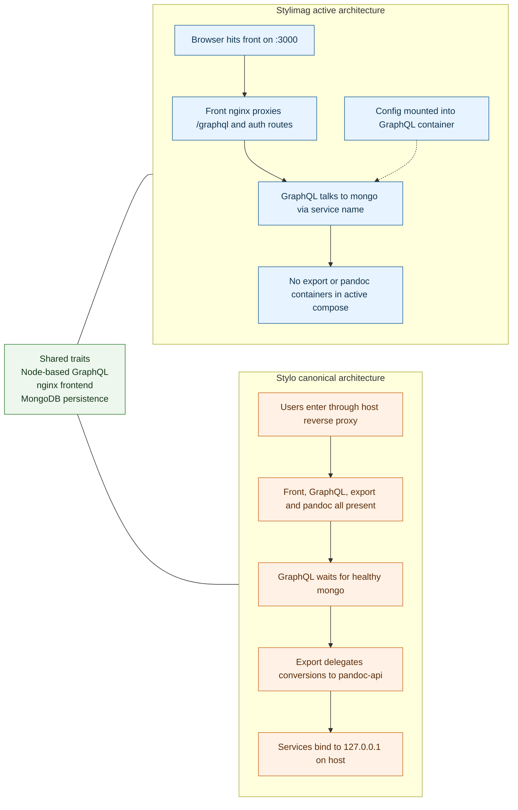

# Stylimag and Stylo Comparison Diagram

This comparison focuses on the main operational differences between the active Stylimag stack and the canonical Stylo stack.

```mermaid
flowchart LR
    classDef stylimag fill:#e7f3ff,stroke:#1d5f91,color:#11344d;
    classDef stylo fill:#fff1e6,stroke:#c96a1b,color:#5a2d08;
    classDef shared fill:#edf7ed,stroke:#2e7d32,color:#15361a;

    subgraph A[Stylimag active architecture]
        a1[Browser hits front on :3000]:::stylimag
        a2[Front nginx proxies /graphql and auth routes]:::stylimag
        a3[GraphQL talks to mongo via service name]:::stylimag
        a4[Config mounted into GraphQL container]:::stylimag
        a5[No export or pandoc containers in active compose]:::stylimag
        a1 --> a2 --> a3 --> a5
        a4 -.-> a3
    end

    subgraph B[Stylo canonical architecture]
        b1[Users enter through host reverse proxy]:::stylo
        b2[Front, GraphQL, export and pandoc all present]:::stylo
        b3[GraphQL waits for healthy mongo]:::stylo
        b4[Export delegates conversions to pandoc-api]:::stylo
        b5[Services bind to 127.0.0.1 on host]:::stylo
        b1 --> b2 --> b3 --> b4 --> b5
    end

    shared1[Shared traits\nNode-based GraphQL\nnginx frontend\nMongoDB persistence]:::shared

    shared1 --- A
    shared1 --- B
```